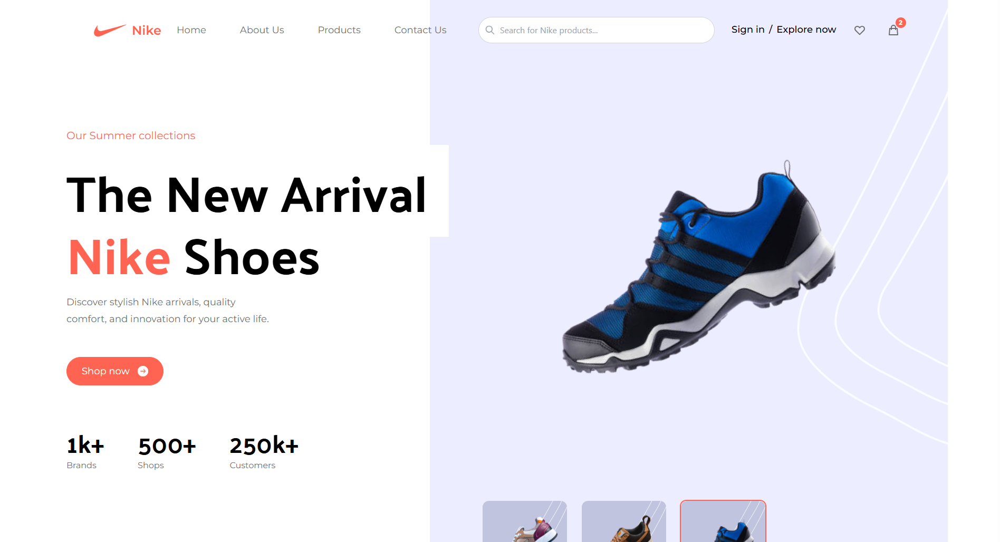
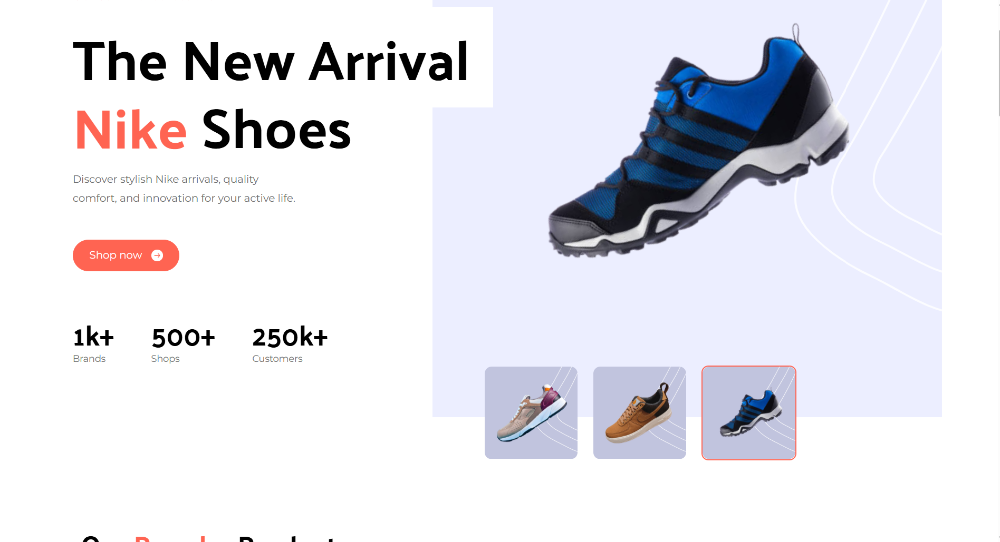
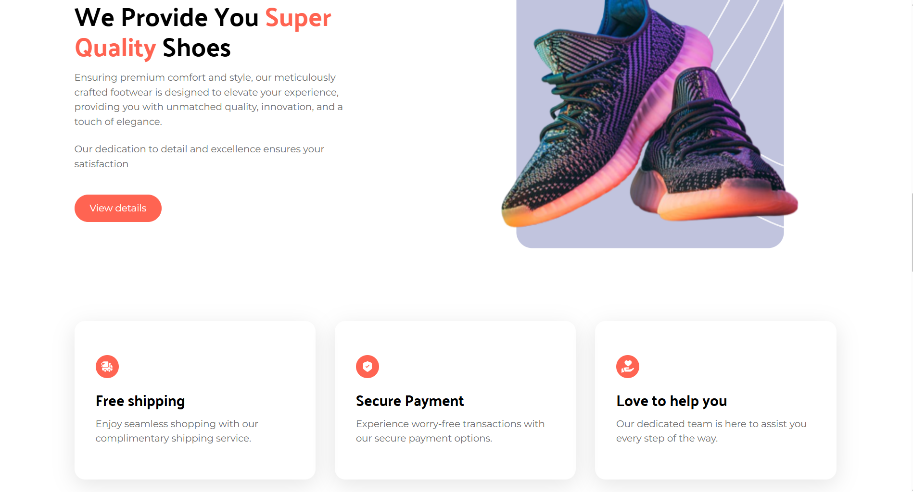
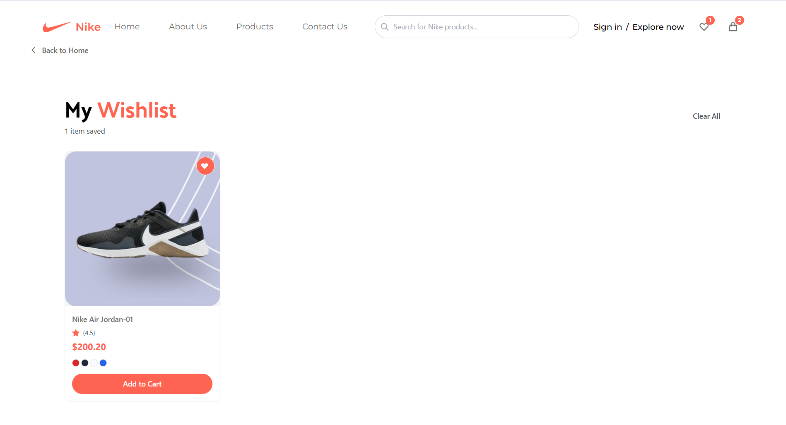
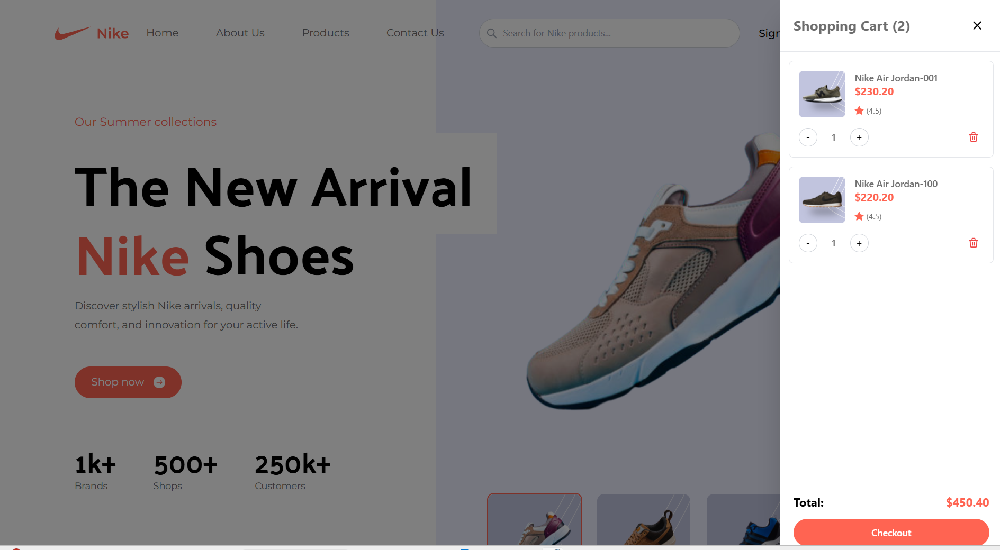
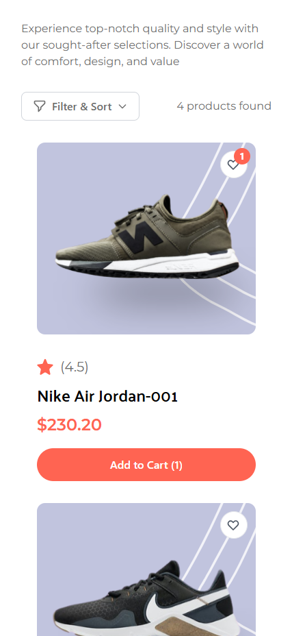
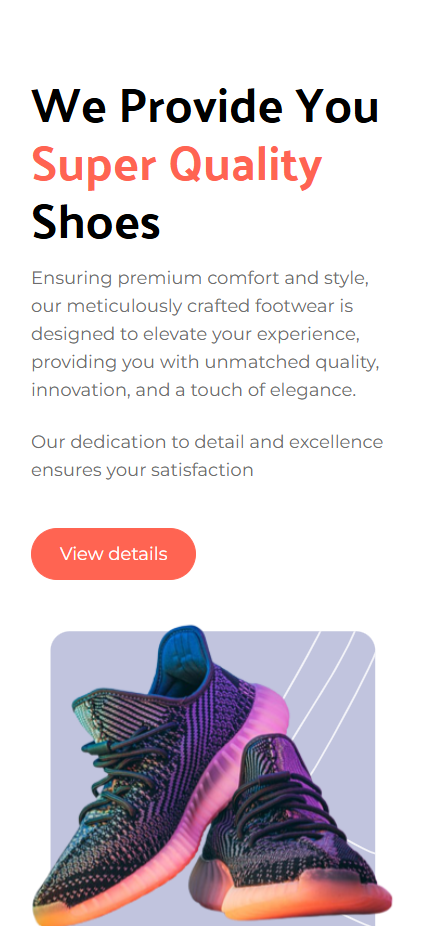
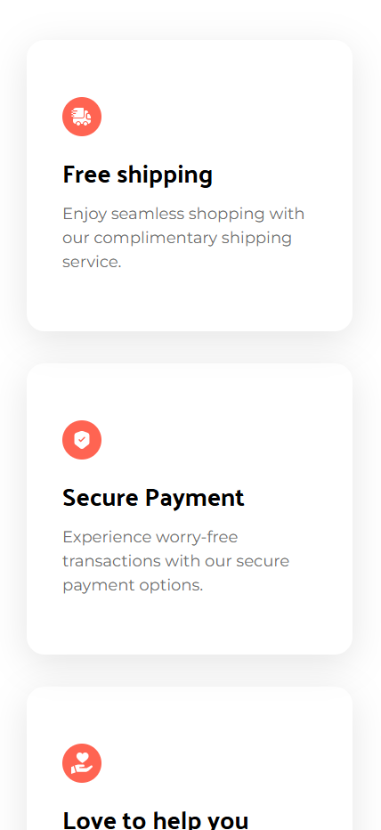
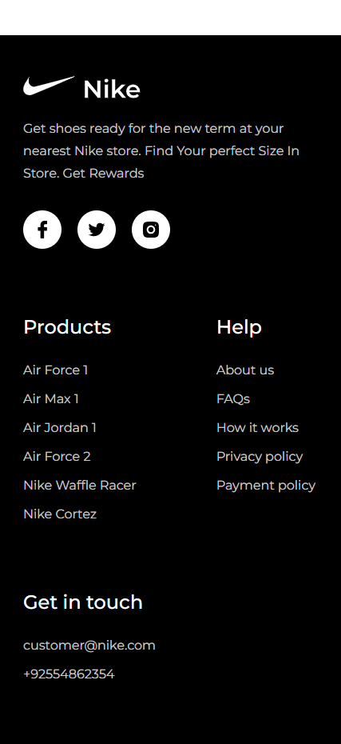

# Nike E-Commerce Website  

A modern Nike-inspired e-commerce website I built using React, TypeScript, and Tailwind CSS. It's a fully functional shopping experience with everything you'd expect - cart management, wishlist, product search, and a clean responsive design that works great on all devices.

## What's Inside  

### Shopping Features
- **Shopping Cart** - Add items, adjust quantities, and everything saves automatically
- **Wishlist** - Heart your favorite shoes and come back to them later
- **Search & Filter** - Find exactly what you're looking for with real-time search
- **Quick View** - Check out product details without leaving the page
- **Smart Pagination** - Browse through products smoothly

### Design & Experience
- **Mobile-First** - Looks great on your phone, tablet, or desktop
- **Nike-Inspired UI** - Clean design that feels familiar and modern
- **Smooth Interactions** - Hover effects, animations, and responsive feedback
- **Loading States** - No awkward blank screens while things load
- **Toast Messages** - Get instant feedback when you add items or encounter issues

### Under the Hood
- **React + TypeScript** - Modern development with type safety
- **Tailwind CSS** - Utility-first styling for consistent design
- **Context API** - Clean state management for cart and wishlist
- **Storybook** - Component documentation and isolated testing
- **Vite** - Lightning-fast development and builds
- **Local Storage** - Your cart and wishlist persist between sessions

 

## 📸 What It Looks Like

### 🖥️ Desktop Experience

<table align="center" style="border-collapse: collapse; margin: 20px 0;">
  <tr>
    <td colspan="2" style="text-align: center; padding: 15px; background: linear-gradient(135deg, #667eea 0%, #764ba2 100%); color: white; font-weight: bold; border-radius: 10px 10px 0 0;">🏠 Homepage & Landing</td>
  </tr>
  <tr>
    <td style="padding: 15px; text-align: center; background: #f8fafc; border: 1px solid #e2e8f0;">
      
    </td>
    <td style="padding: 15px; text-align: center; background: #f8fafc; border: 1px solid #e2e8f0;">
      
    </td>
  </tr>
</table>

<table align="center" style="border-collapse: collapse; margin: 20px 0;">
  <tr>
    <td colspan="3" style="text-align: center; padding: 15px; background: linear-gradient(135deg, #f093fb 0%, #f5576c 100%); color: white; font-weight: bold; border-radius: 10px 10px 0 0;">🛍️ Product Browsing & Search</td>
  </tr>
  <tr>
    <td style="padding: 15px; text-align: center; background: #f8fafc; border: 1px solid #e2e8f0;">
      
    </td>
    <td style="padding: 15px; text-align: center; background: #f8fafc; border: 1px solid #e2e8f0;">
      
    </td>
    <td style="padding: 15px; text-align: center; background: #f8fafc; border: 1px solid #e2e8f0;">
      
    </td>
  </tr>
</table>

<table align="center" style="border-collapse: collapse; margin: 20px 0;">
  <tr>
    <td colspan="2" style="text-align: center; padding: 15px; background: linear-gradient(135deg, #4facfe 0%, #00f2fe 100%); color: white; font-weight: bold; border-radius: 10px 10px 0 0;">⭐ Product Details & Reviews</td>
  </tr>
  <tr>
    <td style="padding: 15px; text-align: center; background: #f8fafc; border: 1px solid #e2e8f0;">
      
    </td>
    <td style="padding: 15px; text-align: center; background: #f8fafc; border: 1px solid #e2e8f0;">
      
    </td>
  </tr>
</table>

<table align="center" style="border-collapse: collapse; margin: 20px 0;">
  <tr>
    <td colspan="3" style="text-align: center; padding: 15px; background: linear-gradient(135deg, #fa709a 0%, #fee140 100%); color: white; font-weight: bold; border-radius: 10px 10px 0 0;">🛒 Cart & Wishlist Management</td>
  </tr>
  <tr>
    <td style="padding: 15px; text-align: center; background: #f8fafc; border: 1px solid #e2e8f0;">
      
    </td>
    <td style="padding: 15px; text-align: center; background: #f8fafc; border: 1px solid #e2e8f0;">
      
    </td>
    <td style="padding: 15px; text-align: center; background: #f8fafc; border: 1px solid #e2e8f0;">
      
    </td>
  </tr>
</table>

### 📱 Mobile Experience

<table align="center" style="border-collapse: collapse; margin: 20px 0;">
  <tr>
    <td colspan="3" style="text-align: center; padding: 15px; background: linear-gradient(135deg, #a8edea 0%, #fed6e3 100%); color: #2d3748; font-weight: bold; border-radius: 10px 10px 0 0;">📱 Mobile Homepage & Navigation</td>
  </tr>
  <tr>
    <td style="padding: 15px; text-align: center; background: #f7fafc; border: 1px solid #e2e8f0;">
      
    </td>
    <td style="padding: 15px; text-align: center; background: #f7fafc; border: 1px solid #e2e8f0;">
      
    </td>
    <td style="padding: 15px; text-align: center; background: #f7fafc; border: 1px solid #e2e8f0;">
      
    </td>
  </tr>
</table>

<table align="center" style="border-collapse: collapse; margin: 20px 0;">
  <tr>
    <td colspan="3" style="text-align: center; padding: 15px; background: linear-gradient(135deg, #ffecd2 0%, #fcb69f 100%); color: #2d3748; font-weight: bold; border-radius: 10px 10px 0 0;">👟 Mobile Product Details & Selection</td>
  </tr>
  <tr>
    <td style="padding: 15px; text-align: center; background: #f7fafc; border: 1px solid #e2e8f0;">
      
    </td>
    <td style="padding: 15px; text-align: center; background: #f7fafc; border: 1px solid #e2e8f0;">
      
    </td>
    <td style="padding: 15px; text-align: center; background: #f7fafc; border: 1px solid #e2e8f0;">
      
    </td>
  </tr>
</table>

<table align="center" style="border-collapse: collapse; margin: 20px 0;">
  <tr>
    <td colspan="3" style="text-align: center; padding: 15px; background: linear-gradient(135deg, #ff9a9e 0%, #fecfef 100%); color: #2d3748; font-weight: bold; border-radius: 10px 10px 0 0;">🔍 Mobile Search & Shopping</td>
  </tr>
  <tr>
    <td style="padding: 15px; text-align: center; background: #f7fafc; border: 1px solid #e2e8f0;">
      
    </td>
    <td style="padding: 15px; text-align: center; background: #f7fafc; border: 1px solid #e2e8f0;">
      
    </td>
    <td style="padding: 15px; text-align: center; background: #f7fafc; border: 1px solid #e2e8f0;">
      
    </td>
  </tr>
</table>

<table align="center" style="border-collapse: collapse; margin: 20px 0;">
  <tr>
    <td colspan="2" style="text-align: center; padding: 15px; background: linear-gradient(135deg, #a18cd1 0%, #fbc2eb 100%); color: #2d3748; font-weight: bold; border-radius: 10px 10px 0 0;">⚙️ Mobile Filters & Checkout</td>
  </tr>
  <tr>
    <td style="padding: 15px; text-align: center; background: #f7fafc; border: 1px solid #e2e8f0;">
      
    </td>
    <td style="padding: 15px; text-align: center; background: #f7fafc; border: 1px solid #e2e8f0;">
      
    </td>
  </tr>
</table>


## 🛠️ Built With

- **React 19.1.0** - The main framework
- **TypeScript** - For better code quality and developer experience
- **Tailwind CSS 3.4.0** - For styling everything
- **Vite 7.0.4** - Super fast development and building
- **Storybook 9.1.0** - Component documentation
- **ESLint** - Code linting and formatting
- **Vitest + Playwright** - Testing setup

## 📁 Project Structure

```
src/
├── components/          # Reusable UI components
│   ├── Button.jsx      # Custom button component
│   ├── Nav.jsx         # Navigation header with cart/wishlist
│   ├── PopularProductCard.jsx # Product cards with cart/wishlist
│   ├── ReviewCard.jsx
│   ├── ServiceCard.jsx
│   ├── ShoeCard.jsx
│   ├── SearchBar.jsx   # Product search functionality
│   ├── FilterSort.jsx  # Filter and sort controls
│   ├── Pagination.jsx  # Page navigation
│   ├── ProductModal.jsx # Quick view modal
│   ├── ShoppingCart.jsx # Shopping cart sidebar
│   ├── WishlistPage.jsx # Wishlist page component
│   ├── WishlistButton.jsx # Add to wishlist button
│   ├── ProductVariants.jsx # Color/size selection
│   ├── ImageZoom.jsx   # Image zoom on hover
│   ├── LoadingSkeleton.jsx # Loading states
│   ├── ProductCardSkeleton.jsx # Product card skeleton
│   ├── Toast.jsx       # Toast notification
│   ├── ToastContainer.jsx # Toast container
│   └── index.js        # Component exports
├── contexts/           # React Context providers
│   ├── CartContext.jsx # Shopping cart state
│   ├── WishlistContext.jsx # Wishlist state
│   └── ToastContext.jsx # Toast notifications
├── sections/           # Page sections
│   ├── Hero.jsx        # Hero/landing section (full-screen)
│   ├── PopularProducts.jsx # Product showcase with search/filter
│   ├── SuperQuality.jsx
│   ├── Services.jsx
│   ├── SpecialOffer.jsx
│   ├── CustomerReviews.jsx
│   ├── Subscribe.jsx
│   ├── Footer.jsx
│   └── index.js
├── assets/             # Static assets
│   ├── icons/          # SVG icons
│   └── images/         # Product images
├── constants/          # App constants and data
│   └── index.js        # Navigation links, products, etc.
├── stories/            # Storybook stories
│   ├── Nav.stories.js
│   ├── NikeButton.stories.js
│   └── ReviewCard.stories.js
├── App.tsx             # Main app component
└── main.tsx            # App entry point
```

##  Components

### Core Components
- **Button**: Customizable button with icon support
- **Nav**: Responsive navigation header with cart and wishlist counters
- **PopularProductCard**: Product display cards with cart/wishlist integration
- **ReviewCard**: Customer review components
- **ServiceCard**: Service feature cards
- **ShoeCard**: Interactive shoe selection cards

### E-Commerce Components
- **ShoppingCart**: Slide-out cart with item management
- **WishlistPage**: Dedicated wishlist page with product grid
- **WishlistButton**: Heart-shaped wishlist toggle button
- **ProductModal**: Quick view modal with product details and variants
- **SearchBar**: Real-time product search with suggestions
- **FilterSort**: Advanced filtering and sorting controls
- **Pagination**: Page navigation for product listings
- **ProductVariants**: Color and size selection components

### UI Enhancement Components
- **ImageZoom**: Hover zoom effects for product images
- **LoadingSkeleton**: Animated loading placeholders
- **ProductCardSkeleton**: Skeleton loader for product cards
- **Toast**: Notification messages for user feedback
- **ToastContainer**: Container for managing toast notifications

### Context Providers
- **CartContext**: Global shopping cart state management
- **WishlistContext**: Global wishlist state with localStorage
- **ToastContext**: Global notification system

### Page Sections
- **Hero**: Full-screen landing section with statistics
- **PopularProducts**: Product showcase with search, filter, and pagination
- **SuperQuality**: Quality assurance section
- **Services**: Service features (shipping, payment, support)
- **SpecialOffer**: Promotional content
- **CustomerReviews**: Customer testimonials
- **Subscribe**: Newsletter signup
- **Footer**: Site footer with links

## 📚 Storybook

This project includes Storybook for component documentation and testing. Stories are available for:

- **Button Component**: Multiple variants and states
- **Navigation**: Desktop and mobile views
- **Review Cards**: Different customer reviews

### Running Storybook

```bash
npm run storybook
```

Storybook will be available at `http://localhost:6006`

## 🛍️ How to Use

### Shopping Cart
- Click the cart icon to see what you've added
- Hit "Add to Cart" on any product you like
- Change quantities right in the cart
- Everything saves automatically - come back anytime!

### Wishlist
- Click the heart on products you want to save for later
- Access your wishlist from the heart icon in the nav
- Your favorites are saved between visits

### Finding Products
- Use the search bar to find specific items
- Filter by category, price, or rating
- Sort however you prefer
- Browse through pages easily

### Quick View
- Click "Quick View" to see details without leaving the page
- Pick colors and sizes
- Add to cart or wishlist right from there

## 🚀 Getting Started

### What You Need

- Node.js (16 or newer)
- npm (comes with Node.js)

### Running Locally

1. **Get the code**
   ```bash
   git clone https://github.com/rezwanqkhan/Nike.git
   cd nike
   ```

2. **Install everything**
   ```bash
   npm install
   ```

3. **Start it up**
   ```bash
   npm run dev
   ```

   Open [http://localhost:5173](http://localhost:5173) to view it in your browser.

## 📜 Available Scripts

```bash
# Development
npm run dev          # Start development server
npm run build        # Build for production
npm run preview      # Preview production build

# Code Quality
npm run lint         # Run ESLint

# Storybook
npm run storybook    # Start Storybook dev server
npm run build-storybook  # Build Storybook

# Testing
npm run test         # Run tests with Vitest
```

## 🎨 Design Features

### Color Palette
- **Primary**: Coral Red (#FF6452)
- **Secondary**: Slate Gray (#6D6D6D)
- **Accent**: Pale Blue (#F5F6FF)
- **Background**: White with subtle variations

### Typography
- **Primary Font**: Palanquin (headings)
- **Secondary Font**: Montserrat (body text)

### Responsive Breakpoints
- **Mobile**: < 640px
- **Tablet**: 640px - 1024px
- **Desktop**: 1024px - 1440px
- **Wide**: > 1440px

## 🔧 Customization

### Adding New Components

1. Create component in `src/components/`
2. Export from `src/components/index.js`
3. Add Storybook story in `src/stories/`

### Modifying Styles

- Update `tailwind.config.js` for theme customization
- Modify component classes for specific styling
- Add custom CSS in `src/index.css` if needed

### Adding New Sections

1. Create section in `src/sections/`
2. Export from `src/sections/index.js`
3. Import and add to `App.tsx`

## 🧪 Testing

The project includes:
- **Vitest**: Unit and integration testing
- **Playwright**: End-to-end testing
- **Storybook**: Component testing and documentation

## 📱 Mobile Optimization

- Mobile-first responsive design
- Touch-friendly interactive elements
- Optimized images and assets
- Smooth scrolling and animations

## 🌐 Browser Support

- Chrome (latest)
- Firefox (latest)
- Safari (latest)
- Edge (latest)

## 📈 Performance

- **Vite**: Fast development and build times
- **Code Splitting**: Automatic code splitting
- **Asset Optimization**: Optimized images and fonts
- **Tree Shaking**: Unused code elimination

## 🤝 Want to Contribute?

I'd love to see what you can add! Here's how:

1. Fork this repo
2. Create your feature branch (`git checkout -b feature/cool-new-thing`)
3. Make your changes and commit them
4. Push to your branch
5. Open a Pull Request

Feel free to open issues for bugs or feature requests too!

## 📄 License

This project is licensed under the MIT License - see the [LICENSE](LICENSE) file for details.

## 🙏 Thanks To

- Nike for the design inspiration
- The React community for amazing docs and support
- Tailwind CSS for making styling actually enjoyable
- [YouTube tutorial](https://www.youtube.com/watch?v=tS7upsfuxmo&t=5106s) that inspired the basic design structure
- Everyone who builds open source tools that make projects like this possible

## 📞 Get in Touch

Have questions or want to chat about the project?

- **GitHub**: [rezwanqkhan](https://github.com/rezwanqkhan)
- **LinkedIn**: [Rezwanullah Quraishi](https://www.linkedin.com/in/rezwanullah-quraishi-608314260/)
- **Email**: rezwankhanq@gmail.com

---

**Built with ❤️ by Rezwanullah Quraishi using React and lots of coffee ☕**
